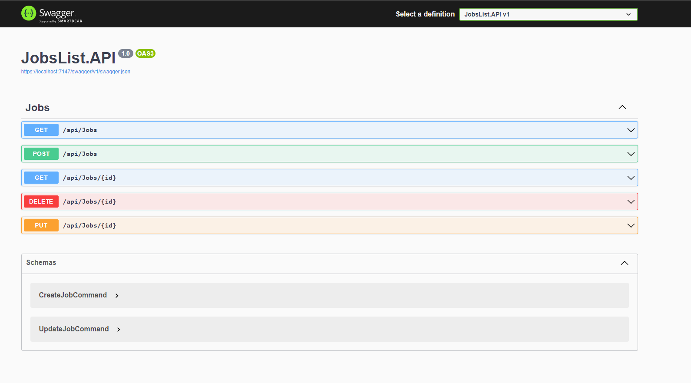

<h1 align="center">Jobs List</h1>

 

  

This is a simple project to implement some clean architectural patterns and properties in an Web API.

## Technologies
- Clean Architecture
- Repository
- Entity Framework Core
- CQRS
- MediatR
- FluentValidation
- Swagger

## Contact

[@Flaviojcf](mailto:flaviojcostafilho@gmail.com)

